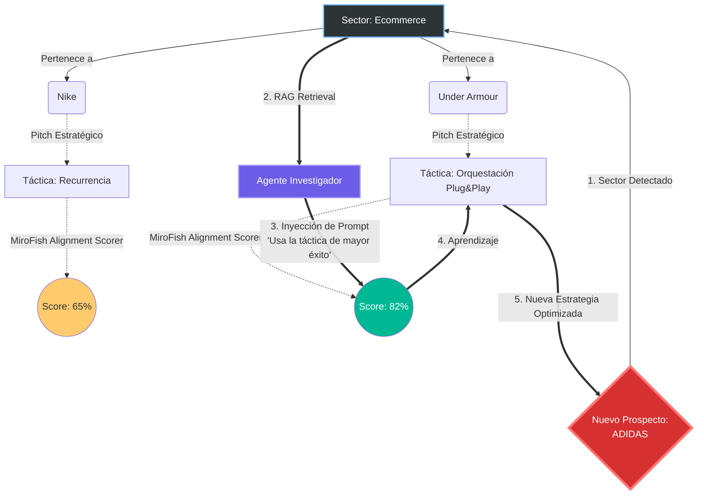

# 🧠 Grafo de Conocimiento: Memoria NERV OS

Este es el esquema visual de cómo la arquitectura NERV implementa Retrieval-Augmented Generation (RAG) usando su `index.json` local.

### Explicación del Flujo de RAG (Para los Data Scientists):
1. **Detección**: Cuando metes a `Adidas` en el batch, el sistema detecta que es del nodo `Sector: Ecommerce`.
2. **Retrieval (Extracción)**: El Agente Investigador consulta el `index.json` filtrando por ese nodo. Descubre que ya existen `Nike` y `Under Armour` en ese clúster.
3. **Análisis de Consenso Pasado**: Observa que la táctica de "Recurrencia" con Nike solo tuvo un **65%** de éxito, pero la táctica de "Orquestación Plug&Play" con Under Armour tuvo un **82%** (MiroFish Score).
4. **Prompt Injection**: El Investigador se inyecta esta premisa en su Prompt antes de hablar con el Gemelo Digital: *"En nuestro histórico, el ángulo de Plug&Play convierte mejor en este sector. Prioriza esa narrativa."*
5. **Evolución**: El nuevo dossier de Adidas nace siendo estadísticamente superior al de Nike porque heredó la memoria colectiva del enjambre.
